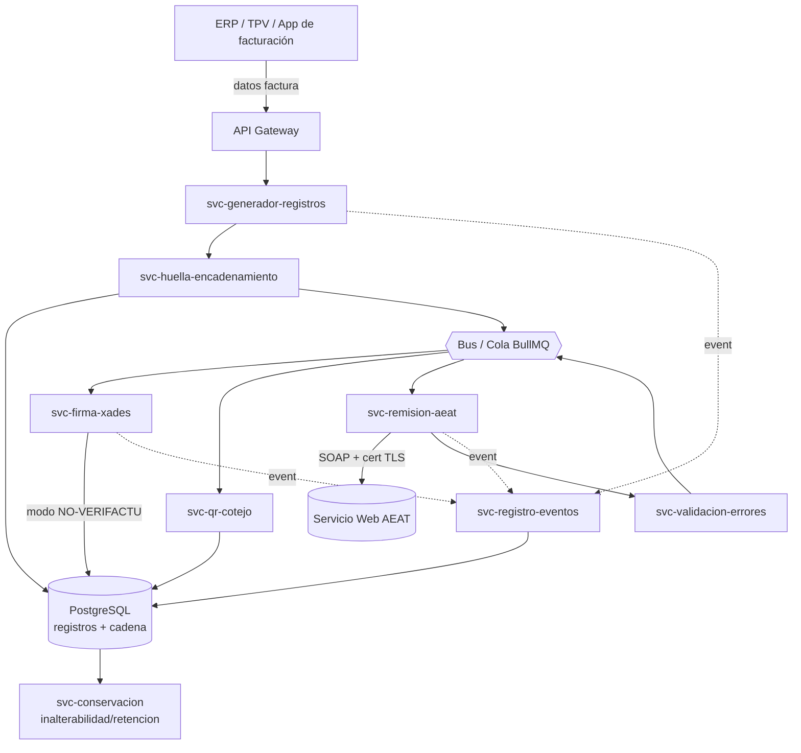
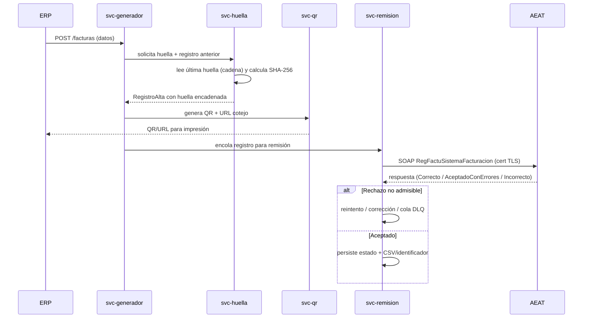
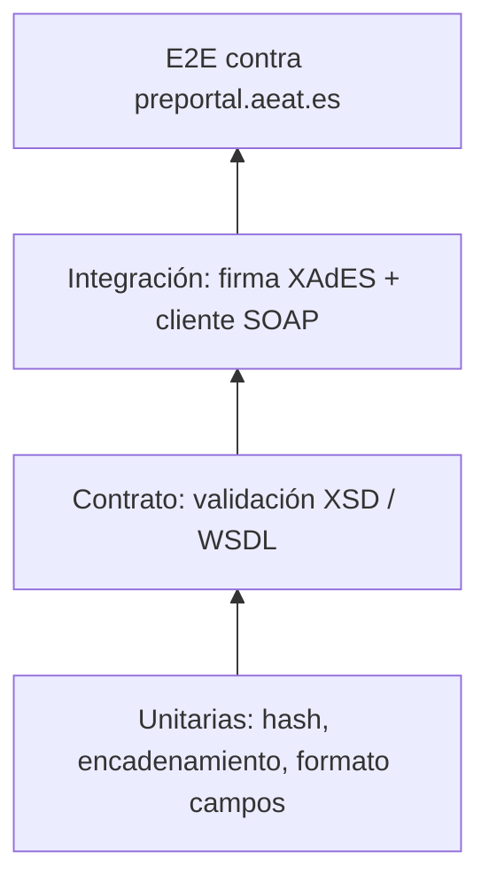

# Guía técnica para el desarrollo de microservicios VeriFactu (Node.js / JavaScript)

> **Documento de arquitectura y desarrollo** para la implementación y pruebas de los Sistemas Informáticos de Facturación (SIF) conforme al marco **VERI\*FACTU** de la Agencia Tributaria española (AEAT).
>
> **Stack:** Node.js (LTS) + JavaScript/TypeScript.
> **Versión del documento:** 1.0 · **Estado:** borrador técnico.
>
> ⚠️ **Aviso de vigencia:** todo dato marcado como *"verificar contra fuente oficial"* (plazos, umbrales, versiones de esquema, formatos exactos de campos) debe contrastarse con la documentación publicada en la Sede Electrónica de la AEAT y el BOE antes de implementarlo. Las especificaciones técnicas se actualizan periódicamente.

---

## Tabla de contenidos

1. [Resumen ejecutivo](#1-resumen-ejecutivo)
2. [Marco normativo](#2-marco-normativo)
3. [Conceptos técnicos núcleo](#3-conceptos-técnicos-núcleo)
4. [Arquitectura de microservicios](#4-arquitectura-de-microservicios)
5. [Contratos de datos](#5-contratos-de-datos)
6. [Integración con la AEAT](#6-integración-con-la-aeat)
7. [Estrategia de pruebas](#7-estrategia-de-pruebas)
8. [Requisitos no funcionales](#8-requisitos-no-funcionales)
9. [Cumplimiento](#9-cumplimiento)
10. [Anexos](#10-anexos)

---

## 1. Resumen ejecutivo

**VERI\*FACTU** es el marco impulsado por la AEAT para garantizar la **integridad, trazabilidad, conservación, accesibilidad, legibilidad e inalterabilidad** de los registros de facturación generados por Sistemas Informáticos de Facturación (SIF). Su objetivo es dificultar el "software de doble uso" y reforzar el control sobre la facturación de empresarios y profesionales.

El sistema contempla **dos modalidades de operación** que un SIF debe poder soportar:

| Modalidad | Descripción | Implicaciones técnicas clave |
|-----------|-------------|------------------------------|
| **VERI\*FACTU** (remisión voluntaria) | El SIF **remite automáticamente y en tiempo (casi) real** cada registro de facturación a la Sede Electrónica de la AEAT. | No exige firma electrónica del registro (la integridad la garantiza el envío + huella encadenada). Requiere cliente del servicio web de la AEAT y control de flujo. |
| **NO VERI\*FACTU** (SIF no verificable) | El SIF **no remite** en tiempo real; conserva los registros localmente. | **Firma electrónica obligatoria** de cada registro (XAdES), encadenamiento por huella, y conservación con disponibilidad para la AEAT a requerimiento. |

> En ambas modalidades son obligatorios el **encadenamiento por huella (hash)** y la **inclusión del código QR** en la factura. *Verificar contra fuente oficial el detalle por modalidad.*

### ¿A quién obliga?

A los empresarios, profesionales y entidades que emitan facturas mediante SIF y que **no estén** acogidos al Suministro Inmediato de Información (SII). *Verificar el ámbito exacto y exclusiones contra el RD 1007/2023 y el RD 254/2025.*

### Plazos (⚠️ verificar contra fuente oficial — dato volátil)

| Hito | Fecha indicativa | Observación |
|------|------------------|-------------|
| Adaptación de los productores/desarrolladores de software | *29-jul-2025* | Los SIF comercializados debían estar adaptados. |
| Obligados — contribuyentes del Impuesto sobre Sociedades | *1-ene-2027* | |
| Obligados — resto del ámbito | *1-jul-2027* | |

> Estas fechas se han modificado por el RD 254/2025 y por notas informativas de ampliación de plazos. **Contrastar siempre con la nota informativa vigente de la AEAT y el BOE.**

### Sobre la "homologación"

**VERI\*FACTU no implica homologación ni certificación previa del software por parte de la AEAT.** El modelo se basa en una **declaración responsable** del fabricante/desarrollador de que el sistema cumple el RRSIF. La AEAT ofrece un **portal de pruebas externas** para validar la integración técnica, pero **no emite un sello de homologación**. Esto condiciona la estrategia de QA: la conformidad la firma el fabricante, soportada por evidencias de pruebas.

---

## 2. Marco normativo

| Norma | Objeto | Referencia (BOE / fuente) |
|-------|--------|---------------------------|
| Ley 58/2003 General Tributaria, art. **29.2.j)** | Obligación tributaria formal de usar sistemas que cumplan los requisitos. | https://www.boe.es/eli/es/l/2003/12/17/58/con#a29 |
| Ley 58/2003 General Tributaria, art. **201 bis** | Infracción por fabricar/comercializar/tener sistemas no conformes. | https://www.boe.es/eli/es/l/2003/12/17/58/con#a2-2 |
| **Ley 11/2021** (Ley antifraude) | Origen de la obligación; introduce los arts. anteriores. | https://www.boe.es/buscar/act.php?id=BOE-A-2021-11473 |
| **Real Decreto 1007/2023** (RRSIF) | Reglamento con los requisitos de los SIF y estandarización de formatos. | https://www.boe.es/buscar/act.php?id=BOE-A-2023-24840 |
| **Real Decreto 254/2025** | Modifica el RD 1007/2023 (ajusta plazos y aspectos del reglamento). | https://www.boe.es/buscar/act.php?id=BOE-A-2025-6600 |
| **Orden HAC/1177/2024** | Desarrolla las especificaciones técnicas, funcionales y de contenido. | https://www.boe.es/buscar/act.php?id=BOE-A-2024-22138 |
| **Resolución 18-dic-2024** | Documentos normalizados para representación de terceros en el envío. | http://www.boe.es/buscar/act.php?id=BOE-A-2024-27600 |
| **RD 1619/2012** | Reglamento de obligaciones de facturación. | http://www.boe.es/buscar/act.php?id=BOE-A-2012-14696 |

**Documentación técnica de la AEAT** (Sede Electrónica → IVA → *Sistemas Informáticos de Facturación (SIF) y VERI\*FACTU* → *Información técnica*): diseños de registro, esquemas XSD, WSDL, documento de validaciones y errores, especificaciones de remisión voluntaria, algoritmo de huella, especificaciones de firma, características del QR y servicio de cotejo, FAQ de desarrolladores. **Portal de pruebas:** https://preportal.aeat.es

---

## 3. Conceptos técnicos núcleo

### 3.1 Registros de facturación

- **Registro de alta (`RegistroAlta`)**: representa la emisión de una factura (o documento sustitutivo). Contiene los datos fiscales, el desglose de IVA, el encadenamiento con el registro anterior y la huella propia.
- **Registro de anulación (`RegistroAnulacion`)**: anula un registro de alta previamente generado. No "borra": deja constancia encadenada de la anulación.
- **Registro de evento (`RegistroEvento`)**: traza eventos del propio SIF exigidos por el reglamento (arranque, restauración, detección de anomalías, exportación, etc.). *Verificar el catálogo exacto de eventos obligatorios contra la Orden HAC/1177/2024.*

### 3.2 Huella (hash) y encadenamiento

Cada registro incluye una **huella** calculada como resumen criptográfico de un subconjunto determinado de sus campos, **concatenado con la huella del registro inmediatamente anterior**. Esto forma una cadena verificable (tamper-evident).

- **Algoritmo:** **SHA-256** sobre una cadena de caracteres compuesta por pares `clave=valor` en un **orden y formato exactos** definidos por la AEAT.
- ⚠️ *Verificar contra fuente oficial* (documento "Algoritmo de cálculo de la huella o hash"): el conjunto de campos, su orden, el tratamiento de mayúsculas, el separador, el formato de importes/fechas y la codificación. **Cualquier desviación rompe la verificación.**

```text
huella = SHA256( campo1=valor1&campo2=valor2&...&Huella anterior=...&FechaHoraHusoGenRegistro=... )
        → resultado en hexadecimal MAYÚSCULAS
(estructura ILUSTRATIVA — el orden y nombres reales se toman del documento oficial)
```

### 3.3 Firma electrónica

- **Obligatoria en modalidad NO VERI\*FACTU** sobre cada registro de facturación y de evento.
- **Formato:** **XAdES** (firma XML avanzada). *Verificar el perfil exacto (p. ej. XAdES Enveloped / nivel) contra "Especificaciones técnicas de la firma electrónica de los registros".*
- En modalidad VERI\*FACTU la firma del registro **no es exigible** porque la integridad se respalda con la remisión + huella.

### 3.4 QR y URL de cotejo

- Cada factura debe incorporar un **código QR** que codifica una **URL del servicio de cotejo** de la AEAT con los parámetros identificativos de la factura (NIF emisor, número, fecha, importe…).
- La factura debe llevar además la leyenda **"VERI\*FACTU"** o "Factura verificable en la sede electrónica de la AEAT" cuando se opere en esa modalidad.
- ⚠️ *Verificar* el dominio del servicio de cotejo, los parámetros, su orden y el nivel de corrección de errores del QR contra "Características del QR y especificaciones del servicio de cotejo".

---

## 4. Arquitectura de microservicios

### 4.1 Principios de diseño

- **Event-driven** con una cola/bus de mensajes para desacoplar generación, firma, remisión y reintentos.
- **Idempotencia** en todos los servicios que producen efectos (clave de idempotencia = identificador de registro + huella).
- **Inmutabilidad**: una vez generado y encadenado, un registro no se modifica; las correcciones se modelan con registros de anulación/sustitución.
- **Trazabilidad de extremo a extremo** mediante `correlationId` propagado en todos los mensajes y logs.

### 4.2 Stack tecnológico propuesto (Node.js)

| Necesidad | Librería / componente sugerido | Notas |
|-----------|-------------------------------|-------|
| Runtime | **Node.js LTS** | TypeScript recomendado para los contratos de datos. |
| Framework de servicio | **NestJS** o **Fastify** | NestJS facilita modularidad e inyección de dependencias. |
| Hash | módulo nativo **`crypto`** (`createHash('sha256')`) | Sin dependencias externas. |
| Construcción/parseo XML | **`xmlbuilder2`** + **`fast-xml-parser`** | Generar XML conforme a XSD. |
| Validación XSD | **`libxmljs2`** | Valida el XML contra los `.xsd` oficiales. |
| Firma XAdES | **`xadesjs`** + **`@peculiar/xmldsigjs`** | Para la modalidad NO VERI\*FACTU. |
| Certificados | **`node-forge`** / **`pem`** | Carga de PKCS#12 (.pfx/.p12), cadena y clave privada. |
| Cliente SOAP | **`soap`** o **`strong-soap`** (o envelope manual con `axios` + `https.Agent` con cert cliente) | TLS con certificado de cliente. |
| QR | **`qrcode`** | Generación PNG/SVG y string. |
| Colas/reintentos | **BullMQ** (Redis) | Backoff exponencial, dead-letter. |
| Persistencia | **PostgreSQL** | Registros, cadena, estado de remisión, auditoría. |
| Observabilidad | **OpenTelemetry** + **pino** | Trazas + logs estructurados. |

### 4.3 Diagrama de arquitectura



### 4.4 Diagrama de secuencia — emisión y remisión (modalidad VERI\*FACTU)



### 4.5 Catálogo de microservicios

> Convención: cada servicio expone API REST interna, publica eventos al bus y propaga `correlationId`.

#### `svc-generador-registros`
- **Responsabilidad:** transformar los datos de negocio (factura del ERP/TPV) en un `RegistroAlta`/`RegistroAnulacion` conforme a los diseños de registro y XSD oficiales.
- **Entradas:** payload de factura (JSON interno).
- **Salidas:** registro estructurado (pre-huella) + evento `registro.creado`.
- **Dependencias:** `svc-huella-encadenamiento`, repositorio de series/numeración.
- **Modalidad:** ambas.
- **Idempotencia:** clave = (NIF emisor + serie + número + tipo registro). Reintentos no duplican.
- **Trazabilidad:** registra `correlationId` y versión de esquema usada.

#### `svc-huella-encadenamiento`
- **Responsabilidad:** recuperar la huella del registro anterior de la cadena, componer la cadena de campos en el **orden oficial** y calcular **SHA-256**.
- **Entradas:** registro pre-huella.
- **Salidas:** registro con `Huella` y referencia `HuellaAnterior`.
- **Dependencias:** PostgreSQL (cadena por emisor/serie).
- **Modalidad:** ambas.
- **Idempotencia:** el cálculo es determinista; protección contra doble inserción en la cadena con lock optimista por emisor.
- ⚠️ **Crítico:** el orden y formato de campos debe replicar exactamente el documento oficial de algoritmo de huella.

#### `svc-firma-xades`
- **Responsabilidad:** firmar electrónicamente el registro (XAdES) y, si aplica, los registros de evento.
- **Entradas:** registro con huella.
- **Salidas:** registro firmado.
- **Dependencias:** almacén de certificados (vault/HSM).
- **Modalidad:** **obligatorio en NO VERI\*FACTU**; no requerido en VERI\*FACTU.
- **Trazabilidad:** guarda el certificado/serial usado y el sello de tiempo.

#### `svc-qr-cotejo`
- **Responsabilidad:** componer la URL del servicio de cotejo con los parámetros oficiales y generar el QR.
- **Entradas:** datos identificativos de la factura.
- **Salidas:** imagen QR + URL + leyenda "VERI\*FACTU".
- **Modalidad:** ambas.
- ⚠️ *Verificar* dominio, parámetros y formato del QR contra la especificación oficial.

#### `svc-remision-aeat`
- **Responsabilidad:** cliente SOAP del servicio web de la AEAT; gestión del certificado de cliente (mTLS); **control de flujo** (tiempo de espera entre envíos y máximo de registros por remisión).
- **Entradas:** uno o varios registros aceptados para envío.
- **Salidas:** respuesta de la AEAT persistida (estado por registro).
- **Dependencias:** WSDL oficial, certificado del obligado/representante, `svc-validacion-errores`.
- **Modalidad:** **VERI\*FACTU** (en NO VERI\*FACTU sólo a requerimiento/exportación).
- **Idempotencia:** no reenviar registros ya aceptados; clave por huella.
- ⚠️ *Verificar* los límites de lote y el tiempo de espera devuelto por la AEAT (`TiempoEsperaEnvio`) contra el documento de especificaciones de remisión.

#### `svc-validacion-errores`
- **Responsabilidad:** interpretar la respuesta de la AEAT y clasificar errores.
- **Lógica:** distingue **errores no admisibles** (impiden el registro → corregir y reenviar) de **errores admisibles** (se registra pero con advertencia). Gestiona reintentos con backoff y cola dead-letter.
- **Modalidad:** VERI\*FACTU.
- ⚠️ *Verificar* el catálogo de códigos contra el "Documento de validaciones y errores".

#### `svc-registro-eventos`
- **Responsabilidad:** generar y conservar los **registros de evento** del SIF exigidos por el reglamento.
- **Entradas:** eventos del sistema (arranque, restauración, anomalía, exportación…).
- **Salidas:** `RegistroEvento` (firmado en NO VERI\*FACTU).
- **Modalidad:** ambas.

#### `svc-conservacion`
- **Responsabilidad:** garantizar **inalterabilidad, integridad, conservación, accesibilidad y legibilidad** de registros durante el periodo de retención; soporta exportación a requerimiento de la AEAT.
- **Mecanismos:** almacenamiento WORM/append-only, verificación periódica de la cadena de huellas, copias.
- **Modalidad:** ambas (especialmente crítico en NO VERI\*FACTU).

---

## 5. Contratos de datos

### 5.1 Estructura resumida del registro de alta (campos principales)

> ⚠️ Lista **orientativa**. Los nombres, cardinalidad, longitudes y obligatoriedad exactos se toman de los **diseños de registro y XSD oficiales**.

| Bloque | Campo (orientativo) | Descripción |
|--------|---------------------|-------------|
| Identificación | `IDVersion` | Versión del formato/esquema. |
| Identificación factura | `IDEmisorFactura`, `NumSerieFactura`, `FechaExpedicionFactura` | Identifican unívocamente la factura. |
| Emisor | `NombreRazonEmisor`, `NIF` | Datos del obligado tributario. |
| Tipo | `TipoFactura`, `TipoRectificativa` | F1, F2, R1…  *(verificar enumeraciones)*. |
| Importes | `CuotaTotal`, `ImporteTotal` | Totales de la factura. |
| Desglose | `Desglose` → `DetalleDesglose` (`TipoImpositivo`, `BaseImponible`, `CuotaRepercutida`…) | Desglose de IVA/operación. |
| Encadenamiento | `Encadenamiento` → `RegistroAnterior` / `PrimerRegistro` | Enlace con el registro previo. |
| Huella | `Huella`, `TipoHuella` | SHA-256 del registro encadenado. |
| Sistema | `SistemaInformatico` (NIF productor, nombre, versión, nº instalación…) | Identifica el SIF. |
| Tiempo | `FechaHoraHusoGenRegistro` | Marca temporal con huso. |
| Firma | `Signature` (XAdES) | Sólo NO VERI\*FACTU. |

### 5.2 Ejemplo de registro (XML — ilustrativo, NO normativo)

```xml
<!-- ESTRUCTURA ILUSTRATIVA. Usar los nombres/namespaces reales de los XSD de la AEAT. -->
<RegistroAlta>
  <IDVersion>1.0</IDVersion>
  <IDFactura>
    <IDEmisorFactura>B12345678</IDEmisorFactura>
    <NumSerieFactura>2027-A/000123</NumSerieFactura>
    <FechaExpedicionFactura>02-01-2027</FechaExpedicionFactura>
  </IDFactura>
  <NombreRazonEmisor>EJEMPLO SL</NombreRazonEmisor>
  <TipoFactura>F1</TipoFactura>
  <CuotaTotal>21.00</CuotaTotal>
  <ImporteTotal>121.00</ImporteTotal>
  <Encadenamiento>
    <RegistroAnterior>
      <IDEmisorFactura>B12345678</IDEmisorFactura>
      <NumSerieFactura>2027-A/000122</NumSerieFactura>
      <FechaExpedicionFactura>02-01-2027</FechaExpedicionFactura>
      <Huella>3C9F...A1</Huella>
    </RegistroAnterior>
  </Encadenamiento>
  <SistemaInformatico>
    <NombreRazon>MI SIF SL</NombreRazon>
    <NIF>B87654321</NIF>
    <NombreSistemaInformatico>FacturaNode</NombreSistemaInformatico>
    <IdSistemaInformatico>01</IdSistemaInformatico>
    <Version>1.0</Version>
    <NumeroInstalacion>0001</NumeroInstalacion>
  </SistemaInformatico>
  <FechaHoraHusoGenRegistro>2027-01-02T10:15:30+01:00</FechaHoraHusoGenRegistro>
  <TipoHuella>01</TipoHuella>
  <Huella>9B2E7C...FF</Huella>
</RegistroAlta>
```

### 5.3 Ejemplo de respuesta de la AEAT (ilustrativo)

```xml
<RespuestaRegFactuSistemaFacturacion>
  <CSV>ABCD1234EFGH5678</CSV>
  <DatosPresentacion>
    <NIFPresentador>B87654321</NIFPresentador>
    <TimestampPresentacion>2027-01-02T10:15:35+01:00</TimestampPresentacion>
  </DatosPresentacion>
  <EstadoEnvio>ParcialmenteCorrecto</EstadoEnvio>
  <RespuestaLinea>
    <IDFactura>...</IDFactura>
    <EstadoRegistro>AceptadoConErrores</EstadoRegistro>
    <CodigoErrorRegistro>1100</CodigoErrorRegistro>
    <DescripcionErrorRegistro>...</DescripcionErrorRegistro>
  </RespuestaLinea>
  <TiempoEsperaEnvio>60</TiempoEsperaEnvio>
</RespuestaRegFactuSistemaFacturacion>
```

> ⚠️ Los nombres de elementos, estados y códigos anteriores son **ilustrativos**. Tomar los reales del **WSDL**, los **XSD** y el **documento de validaciones y errores**.

### 5.4 Modelo interno (JSON — para el bus de mensajes)

```json
{
  "correlationId": "c1b2a3-...",
  "tipoRegistro": "ALTA",
  "modalidad": "VERIFACTU",
  "factura": {
    "nifEmisor": "B12345678",
    "serie": "2027-A",
    "numero": "000123",
    "fechaExpedicion": "2027-01-02",
    "importeTotal": 121.00,
    "cuotaTotal": 21.00
  },
  "encadenamiento": { "huellaAnterior": "3C9F...A1" },
  "huella": null,
  "estado": "PENDIENTE_HUELLA"
}
```

---

## 6. Integración con la AEAT

### 6.1 Servicio web

- **Protocolo:** SOAP (servicio web de remisión de registros de facturación).
- **Contrato:** definido por el **WSDL oficial** publicado en *Información técnica → WSDL de los servicios web*.
- **Operación principal:** remisión de registros de alta y anulación (mensaje con **cabecera** del obligado tributario y, opcionalmente, del representante, más una **lista de registros**).
- **Entornos:** **pruebas** (preportal) y **producción**. *Verificar las URLs concretas de cada entorno en la documentación oficial.*

### 6.2 Autenticación

- **mTLS con certificado electrónico** del obligado tributario o de un representante autorizado (ver Resolución 18-dic-2024 para representación de terceros).
- En Node.js, configurar el agente HTTPS con el PKCS#12:

```js
import https from 'node:https';
import fs from 'node:fs';

const agent = new https.Agent({
  pfx: fs.readFileSync(process.env.CERT_PATH),  // .p12 / .pfx
  passphrase: process.env.CERT_PASS,
  keepAlive: true,
  minVersion: 'TLSv1.2'
});
// Pasar `agent` al cliente SOAP / axios. El cert NUNCA en el repositorio.
```

### 6.3 Control de flujo

- La AEAT impone un **tiempo de espera entre envíos** y un **máximo de registros por remisión**.
- El campo de respuesta (`TiempoEsperaEnvio` o equivalente) indica cuántos segundos esperar antes del siguiente envío. El `svc-remision-aeat` debe **respetar dinámicamente** ese valor (no enviar antes).
- Implementar **rate limiting** y agrupación en lotes acotada al máximo permitido. ⚠️ *Verificar* límites exactos.

### 6.4 Manejo de respuestas

| Estado (orientativo) | Significado | Acción del servicio |
|----------------------|-------------|---------------------|
| **Correcto** | Registro aceptado sin incidencias. | Persistir CSV/identificador y estado. |
| **AceptadoConErrores** | Registrado pero con advertencia (error *admisible*). | Persistir, registrar advertencia, no reenviar. |
| **Incorrecto / Rechazado** | Error *no admisible*: no se registra. | Corregir el dato, regenerar si procede y reenviar. |

---

## 7. Estrategia de pruebas

### 7.1 Portal de pruebas externas

- **URL:** https://preportal.aeat.es
- **Requisitos:** certificado electrónico válido admitido en el entorno de pruebas. *Verificar si se requiere alta previa o certificados específicos de test.*
- **Propósito:** validar la integración (envío/recepción, formatos, encadenamiento) **sin efectos fiscales reales**. No constituye homologación.

### 7.2 Pirámide de pruebas



### 7.3 Pruebas unitarias — hash y encadenamiento

- **Vectores de prueba:** construir casos con entrada conocida → huella esperada, **derivados de los ejemplos del documento oficial de algoritmo de huella** (no inventar la huella esperada).
- Verificar: orden de campos, formato de importes/fechas, mayúsculas, encadenamiento del primer registro (`PrimerRegistro`) vs registros siguientes.

```js
import { createHash } from 'node:crypto';

function calcularHuella(cadenaCampos) {
  return createHash('sha256').update(cadenaCampos, 'utf8').digest('hex').toUpperCase();
}
// test: comparar contra el valor del EJEMPLO OFICIAL de la AEAT
```

### 7.4 Pruebas de firma electrónica

- Verificar que la firma XAdES valida con la cadena del certificado y que el perfil coincide con la especificación oficial.
- Comprobar firma de registros de **evento** además de los de facturación.

### 7.5 Pruebas de contrato (XSD / WSDL)

- Validar cada XML generado contra los **XSD oficiales** con `libxmljs2` en el pipeline de CI (fallar el build si no valida).

```js
import libxml from 'libxmljs2';
const xsd = libxml.parseXml(fs.readFileSync('SuministroLR.xsd', 'utf8'));
const doc = libxml.parseXml(xmlGenerado);
if (!doc.validate(xsd)) throw new Error(doc.validationErrors.join('\n'));
```

### 7.6 Pruebas E2E

- Flujo completo contra `preportal`: alta → respuesta correcta; alta con error no admisible → rechazo y corrección; anulación de un alta previa; remisión por lotes respetando el control de flujo.

### 7.7 Casos de error a cubrir

| Caso | Resultado esperado |
|------|--------------------|
| Campo obligatorio ausente | Error no admisible → rechazo. |
| Huella anterior incorrecta / cadena rota | Error → no aceptado. |
| Importes incoherentes (base/cuota) | Error admisible o no admisible según catálogo. |
| Reenvío de registro ya aceptado | Idempotencia: no duplicar. |
| Superar máximo de registros por lote | Particionar en varios envíos. |
| Envío antes del `TiempoEsperaEnvio` | Respetar espera (no enviar). |

### 7.8 Checklist previo a producción

- [ ] XML valida contra los XSD vigentes.
- [ ] Huella reproduce los vectores oficiales.
- [ ] Encadenamiento correcto (primer registro y sucesivos).
- [ ] Firma XAdES válida (modalidad NO VERI\*FACTU).
- [ ] QR y URL de cotejo conformes; leyenda "VERI\*FACTU" presente.
- [ ] Control de flujo respetado dinámicamente.
- [ ] Gestión de errores admisibles/no admisibles.
- [ ] Registros de evento generados según catálogo.
- [ ] Certificado gestionado de forma segura (no en repositorio).
- [ ] **Declaración responsable** preparada con evidencias de pruebas.

---

## 8. Requisitos no funcionales

| Categoría | Requisito |
|-----------|-----------|
| **Seguridad** | mTLS; secretos en vault; principio de mínimo privilegio; auditoría de accesos. |
| **Custodia del certificado** | Almacén seguro (HSM o vault); rotación; nunca en código ni en variables de entorno en claro en producción. |
| **Integridad / inalterabilidad** | Almacenamiento append-only/WORM; verificación periódica de la cadena de huellas; detección de manipulación (genera registro de evento de anomalía). |
| **Observabilidad** | Trazas distribuidas (OpenTelemetry), logs estructurados (pino), métricas de cola y de respuestas AEAT. |
| **Idempotencia** | Claves de idempotencia por huella; deduplicación en remisión. |
| **Alta disponibilidad** | Servicios stateless escalables horizontalmente; cola persistente; reintentos con backoff y DLQ. |
| **Conservación** | Retención durante el plazo legal; exportación a requerimiento. *Verificar plazo de conservación.* |
| **Rendimiento** | Respetar el control de flujo de la AEAT sin saturar; backpressure en la cola. |

---

## 9. Cumplimiento

### 9.1 Declaración responsable

VERI\*FACTU **no se homologa**: el fabricante/desarrollador emite una **declaración responsable** de conformidad del SIF con el RRSIF. Debe contener (⚠️ *verificar contenido exacto contra la Orden HAC/1177/2024 y los ejemplos oficiales de declaración responsable*):

- Identificación del productor del software (NIF, razón social).
- Identificación y versión del SIF.
- Manifestación de cumplimiento de los requisitos del RD 1007/2023 y la Orden HAC/1177/2024.
- Mención de la modalidad soportada (VERI\*FACTU y/o no verificable).

### 9.2 Trazabilidad y evidencias

- Conservar evidencias de las pruebas en `preportal` (peticiones/respuestas, CSV).
- Mantener la **cadena de huellas verificable** y los **registros de evento** como prueba de integridad.
- Versionar los esquemas/contratos usados por cada registro emitido.

---

## 10. Anexos

### 10.1 Glosario

| Término | Definición |
|---------|------------|
| **SIF** | Sistema Informático de Facturación. |
| **RRSIF** | Reglamento de requisitos de los SIF (RD 1007/2023). |
| **VERI\*FACTU** | Modalidad con remisión automática de registros a la AEAT. |
| **Huella** | Hash SHA-256 encadenado de un registro. |
| **Registro de alta / anulación / evento** | Tipos de registro de facturación/sistema. |
| **Cotejo** | Servicio AEAT de verificación de una factura vía QR/URL. |
| **CSV** | Código Seguro de Verificación devuelto por la AEAT. |
| **Declaración responsable** | Manifestación del fabricante de conformidad del SIF. |
| **mTLS** | TLS con autenticación mutua mediante certificado de cliente. |

### 10.2 Enlaces oficiales

| Recurso | URL |
|---------|-----|
| Página principal SIF y VERI\*FACTU (AEAT) | https://sede.agenciatributaria.gob.es/Sede/iva/sistemas-informaticos-facturacion-verifactu.html |
| Información técnica (índice) | https://sede.agenciatributaria.gob.es/Sede/iva/sistemas-informaticos-facturacion-verifactu/informacion-tecnica.html |
| Diseños de registro | https://sede.agenciatributaria.gob.es/Sede/iva/sistemas-informaticos-facturacion-verifactu/informacion-tecnica/disenos-registro.html |
| WSDL de los servicios web | https://sede.agenciatributaria.gob.es/Sede/iva/sistemas-informaticos-facturacion-verifactu/informacion-tecnica/wsdl-servicios-web.html |
| Esquemas (XSD) | https://sede.agenciatributaria.gob.es/Sede/iva/sistemas-informaticos-facturacion-verifactu/informacion-tecnica/esquemas.html |
| Documento de validaciones y errores | https://sede.agenciatributaria.gob.es/Sede/iva/sistemas-informaticos-facturacion-verifactu/informacion-tecnica/documento-validaciones-errores.html |
| Especificaciones de remisión voluntaria | https://sede.agenciatributaria.gob.es/Sede/iva/sistemas-informaticos-facturacion-verifactu/informacion-tecnica/especificaciones-servicios-remision-voluntaria-registros-validaciones.html |
| Algoritmo de huella (hash) | https://sede.agenciatributaria.gob.es/Sede/iva/sistemas-informaticos-facturacion-verifactu/informacion-tecnica/algoritmo-calculo-codificacion-huella-hash.html |
| Firma electrónica de registros y evento | https://sede.agenciatributaria.gob.es/Sede/iva/sistemas-informaticos-facturacion-verifactu/informacion-tecnica/especificaciones-tecnicas-firma-electronica-registros-evento.html |
| Características del QR y servicio de cotejo | https://sede.agenciatributaria.gob.es/Sede/iva/sistemas-informaticos-facturacion-verifactu/informacion-tecnica/caracteristicas-qr-especificaciones-servicio-cotejo-factura.html |
| Ejemplos de declaraciones responsables | https://sede.agenciatributaria.gob.es/Sede/iva/sistemas-informaticos-facturacion-verifactu/informacion-tecnica/ejemplo-declaracion-responsable.html |
| FAQ desarrolladores (PDF) | https://sede.agenciatributaria.gob.es/static_files/AEAT_Desarrolladores/EEDD/IVA/VERI-FACTU/FAQs-Desarrolladores.pdf |
| Portal de pruebas externas | https://preportal.aeat.es |
| BOE — RD 1007/2023 | https://www.boe.es/buscar/act.php?id=BOE-A-2023-24840 |
| BOE — RD 254/2025 | https://www.boe.es/buscar/act.php?id=BOE-A-2025-6600 |
| BOE — Orden HAC/1177/2024 | https://www.boe.es/buscar/act.php?id=BOE-A-2024-22138 |

### 10.3 Supuestos y decisiones pendientes

| # | Tema | Pendiente de confirmar |
|---|------|------------------------|
| 1 | Plazos de obligatoriedad | Fechas finales tras RD 254/2025 y notas de ampliación. |
| 2 | Orden exacto de campos para la huella | Documento oficial de algoritmo de huella. |
| 3 | Perfil/nivel XAdES | Especificación de firma electrónica. |
| 4 | Formato/parámetros del QR y dominio de cotejo | Características del QR. |
| 5 | Límite de registros por remisión y tiempo de espera | Especificaciones de remisión voluntaria. |
| 6 | Versión vigente de los XSD | Sección de esquemas. |
| 7 | Catálogo de eventos obligatorios del SIF | Orden HAC/1177/2024. |
| 8 | Plazo de conservación de registros | RRSIF. |

---

> **Recordatorio final:** este documento es una **guía de arquitectura**, no un sustituto de las especificaciones oficiales. Antes de codificar la huella, la firma, el QR o el contrato SOAP, descarga y sigue los documentos vigentes de la Sede Electrónica de la AEAT. Cualquier desviación en el algoritmo de huella, el orden de campos o el formato rompe la verificación y provoca el rechazo de los registros.
